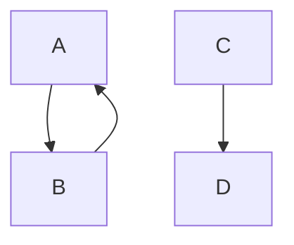
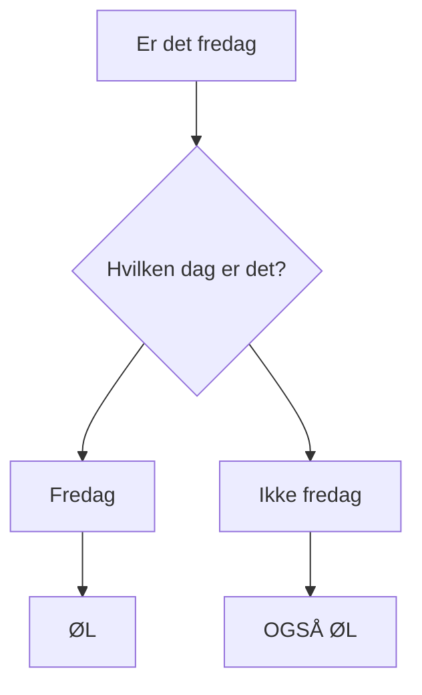

* Den der test der

```mermaid
  graph TD;
  A --> B;
  B --> A;
  C --> D;
```

```mermaid
  flowchart TD;
  A[Er det fredag] --> B{Hvilken dag er det?};
  B --> C[Fredag];
  B --> D[Ikke fredag];
  C --> E[ØL];
  D --> F[OGSÅ ØL];
```
